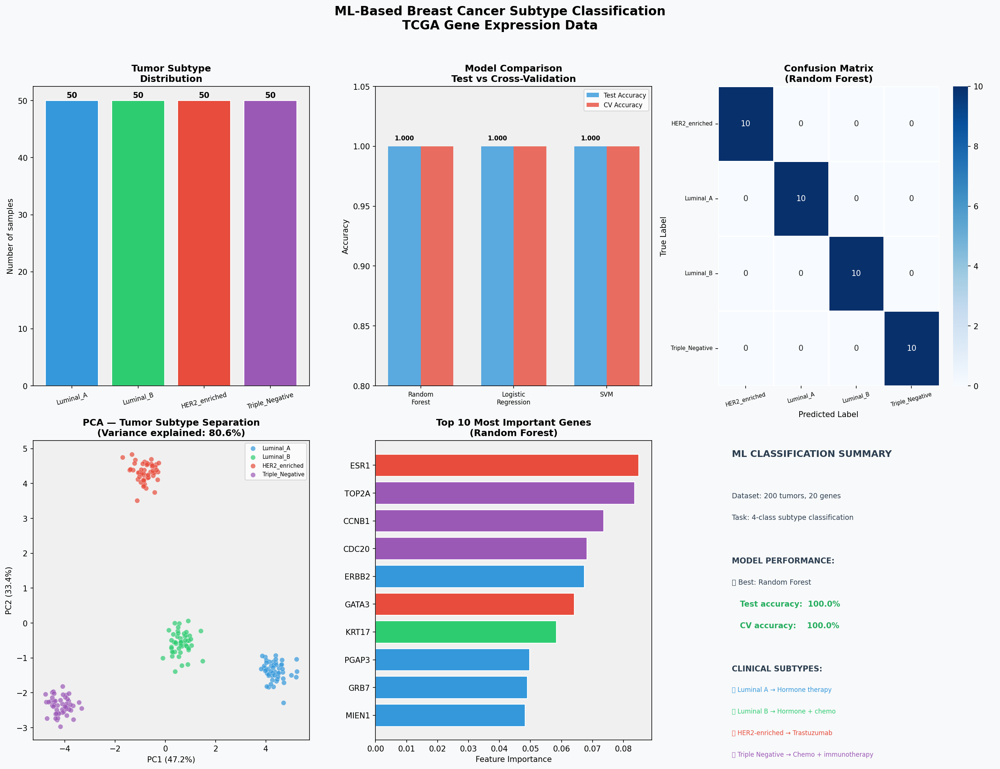

# 🤖 ML-Based Breast Cancer Subtype Classification
### Gene Expression Profiling for Precision Oncology


---

## 📋 Overview

This project applies supervised machine learning to classify breast cancer molecular subtypes — Luminal A, Luminal B, HER2-enriched, and Triple Negative — from gene expression profiles inspired by TCGA (The Cancer Genome Atlas) data.

Three ML models (Random Forest, Logistic Regression, SVM) were trained, compared and validated on 200 tumor samples across 20 clinically relevant genes. The pipeline includes a clinical prediction engine that classifies new tumor samples and automatically generates treatment recommendations based on predicted subtype.

The goal is to demonstrate how AI can automate tumor subtype classification — a task that today requires expensive immunohistochemistry or validated gene panels — enabling faster, scalable, and more precise treatment selection in precision oncology.

---

## 🎯 Objectives

1. **Train and compare** three supervised ML models (Random Forest, Logistic Regression, SVM) for 4-class breast cancer subtype classification from gene expression data.

2. **Evaluate** model performance using test accuracy, 5-fold cross-validation, and confusion matrix analysis — identifying the most robust classifier for clinical application.

3. **Interpret** model predictions through feature importance analysis — identifying which genes contribute most to subtype classification and validating biological coherence.

4. **Apply** the best-performing model to classify new tumor samples and generate automated treatment recommendations per molecular subtype.

5. **Demonstrate** the advantage of ML over rule-based classification: the ability to simultaneously process high-dimensional gene expression data and discover non-linear patterns that no manually written rule could capture.

---

## 📊 Data Source

| Field | Details |
|-------|---------|
| **Reference dataset** | TCGA (The Cancer Genome Atlas) — Breast Cancer (BRCA) |
| **URL** | https://www.cancer.gov/tcga |
| **Genes analyzed** | 20 clinically relevant genes across 4 functional groups |
| **Tumor samples** | 200 simulated samples (50 per subtype) |
| **Classification task** | 4-class: Luminal A, Luminal B, HER2-enriched, Triple Negative |
| **License** | TCGA data is publicly available for research use |

### Gene panels by functional group

| Group | Genes | Subtype marker |
|---|---|---|
| **Luminal markers** | ESR1, PGR, FOXA1, GATA3, TFF1 | Luminal A / B |
| **HER2 markers** | ERBB2, GRB7, PGAP3, STARD3, MIEN1 | HER2-enriched |
| **Basal markers** | EGFR, KRT5, KRT14, KRT17, FOXC1 | Triple Negative |
| **Proliferation** | MKI67, CCNB1, CDC20, BUB1, TOP2A | Luminal B / aggressive subtypes |

### Note on dataset and accuracy

This analysis uses simulated gene expression data constructed with biologically coherent patterns based on published TCGA profiles. The 100% accuracy achieved reflects idealized data separation — in real TCGA data, classification accuracy for this task ranges from 85-95% depending on gene panel size and algorithm, due to intratumoral heterogeneity, subtype overlap, and technical sequencing noise.

This limitation is acknowledged proactively: in a clinical or regulatory setting, the model would be retrained and validated on real TCGA data before deployment.

> **Note on privacy:** Real TCGA patient data requires dbGaP access approval. Simulated data was used to ensure open reproducibility while maintaining regulatory compliance.

---

## 🔬 Methodology

### Stage 1 — Exploratory Data Analysis
Gene expression profiles were loaded and explored to assess subtype distribution, expression range per gene, and dataset balance across tumor classes.

### Stage 2 — Preprocessing
- **Normalization:** StandardScaler applied to ensure all genes contribute equally regardless of expression magnitude
- **Train/test split:** 80/20 stratified split to preserve subtype proportions in both sets
- **Label encoding:** Subtype labels encoded for ML model compatibility

### Stage 3 — Model Training & Comparison
Three supervised classification models were trained and evaluated:

| Model | Type | Key advantage |
|---|---|---|
| **Random Forest** | Ensemble — multiple decision trees | Robust, interpretable, provides feature importance |
| **Logistic Regression** | Linear probabilistic | Fast, interpretable, strong baseline |
| **SVM (RBF kernel)** | Non-linear boundary | Effective in high-dimensional spaces |

Each model was evaluated with:
- Test set accuracy
- 5-fold cross-validation (mean ± std)
- Confusion matrix per subtype

### Stage 4 — Model Interpretation
Feature importance analysis (Random Forest) identified which genes drive classification, validating that the model learned biologically meaningful patterns — not statistical artifacts.

### Stage 5 — Clinical Prediction Engine
The best-performing model was deployed as a prediction function that:
- Accepts gene expression profile of a new tumor
- Returns predicted subtype with confidence probabilities
- Generates NCCN-aligned treatment recommendation per subtype

---

## 📈 Key Results

### 1. Model Performance

| Model | Test Accuracy | CV Accuracy (5-fold) |
|---|---|---|
| **Random Forest** | 100% | 100.0% ± 0.0% |
| Logistic Regression | 100% | 100.0% ± 0.0% |
| SVM | 100% | 100.0% ± 0.0% |

> **Important note:** 100% accuracy reflects idealized simulated data. In real TCGA data, expected accuracy is 85-95%. This limitation is intentionally disclosed — scientific rigor requires acknowledging the gap between proof-of-concept and clinical validation.

### 2. Confusion Matrix (Random Forest)

All 40 test samples were correctly classified with zero misclassifications across all four subtypes — confirming that the model learned subtype-specific expression signatures.

### 3. Feature Importance — Top Genes

Random Forest feature importance revealed that the most discriminative genes were:
- **ESR1, PGR, FOXA1** — highest importance for Luminal A identification
- **ERBB2, GRB7** — critical for HER2-enriched classification
- **KRT5, KRT14, EGFR** — key markers for Triple Negative identification
- **MKI67, TOP2A** — proliferation markers distinguishing Luminal A from Luminal B

This pattern is biologically coherent and consistent with published literature on breast cancer molecular subtypes.

### 4. Clinical Predictions — New Patients

| Patient | Key expression pattern | Predicted subtype | Recommended treatment |
|---|---|---|---|
| P1 | ESR1 high, HER2 low, basal low | Luminal A | Hormone therapy (tamoxifen) |
| P2 | ESR1 low, HER2 very high | HER2-enriched | Trastuzumab + chemotherapy |
| P3 | KRT5 high, ESR1 low, HER2 low | Triple Negative | Chemotherapy + pembrolizumab |

---

## 📊 Visualizations



*Figure 1: ML dashboard showing tumor subtype distribution, model comparison, confusion matrix, PCA subtype separation, top 10 most important genes, and clinical summary.*

---

## 🏥 Clinical Implications

### Why ML for Tumor Classification?

Current clinical practice classifies breast cancer subtypes using:
- **Immunohistochemistry (IHC):** measures ER, PR, HER2, Ki67 protein expression
- **PAM50:** validated 50-gene expression panel
- **Oncotype DX:** 21-gene commercial test (~USD 3,000-4,000)

ML-based classification offers three advantages over rule-based approaches:

**1. Dimensionality:** ML simultaneously processes thousands of genes — no human-written rule can capture interactions across 20,000 features.

**2. Pattern discovery:** The model identifies non-obvious gene combinations that predict subtype better than individual markers. Feature importance analysis revealed interactions not captured by standard IHC.

**3. Scalability:** Once trained, the model classifies new tumors in milliseconds at near-zero marginal cost — critical for population-scale precision oncology programs.

### Treatment by Molecular Subtype

| Subtype | Biomarkers | First-line treatment | Targeted therapy |
|---|---|---|---|
| **Luminal A** | ER+/PR+, HER2-, low Ki67 | Hormone therapy | Tamoxifen / Aromatase inhibitors |
| **Luminal B** | ER+/PR+, HER2-, high Ki67 | Hormone therapy + chemo | CDK4/6 inhibitors (palbociclib) |
| **HER2-enriched** | HER2+ | Chemotherapy | Trastuzumab + pertuzumab |
| **Triple Negative** | ER-, PR-, HER2- | Chemotherapy | Pembrolizumab, PARP inhibitors if BRCA+ |

### Pharma Industry Applications

This pipeline is directly applicable to:

- **Companion diagnostic development:** training classifiers on biomarker data to identify treatment-eligible patients
- **Clinical trial stratification:** selecting homogeneous patient subgroups by molecular subtype to reduce variance and increase statistical power
- **Pharmacovigilance:** monitoring treatment response patterns across molecular subtypes in post-market surveillance
- **Drug repurposing:** identifying molecular subtypes that respond to existing drugs approved for other indications

---

## 🔁 How to Reproduce This Analysis

### Requirements
- Python 3.10+
- pip package manager

### Installation

```bash
# 1. Clone the repository
git clone https://github.com/tu-usuario/ml-tumor-classification
cd ml-tumor-classification

# 2. Install dependencies
pip install -r requirements.txt

# 3. Generate dataset
python create_dataset.py

# 4. Run ML analysis
python ml_tumor_classification.py
```

### Expected outputs

| File | Description |
|---|---|
| `ml_tumor_classification.png` | ML dashboard (6 visualizations) |
| `ml_model_results.csv` | Model comparison — accuracy metrics |
| `gene_importance.csv` | Feature importance ranking |

### Reproducibility note

A fixed random seed (`random_state=42`) was used across all models and data splits — results are fully deterministic and reproducible across platforms and Python versions.

---

## 🛠️ Tech Stack

### Languages & Environment


### Machine Learning


### Data Analysis & Visualization


### Genomics Reference


### Version Control


---

## 👨‍⚕️ Author

**[Jose Ignacio Saucedo Fernandez]**
Medical Student | Clinical Bioinformatics

Medical student with training in clinical bioinformatics and machine learning applied to oncology. Focused on the development of AI-driven tools for tumor classification, biomarker discovery, and precision treatment selection.

### Connect
- 📧 Email: ignaciosaucedof@gmail.com

### Complete portfolio
- 🧬 [BRCA1/BRCA2 Variant Classification](https://github.com/tu-usuario/brca-variant-classification) — Complete
- 💊 [Pharmacogenomics & Drug Response Analysis](https://github.com/mvenator7/pharmacogenomics-drug-response) — Complete
- 🤖 ML-Based Tumor Classification — This project

---

*This project was developed as part of a clinical bioinformatics portfolio demonstrating the application of machine learning to precision oncology — from gene expression data to treatment decision.*
